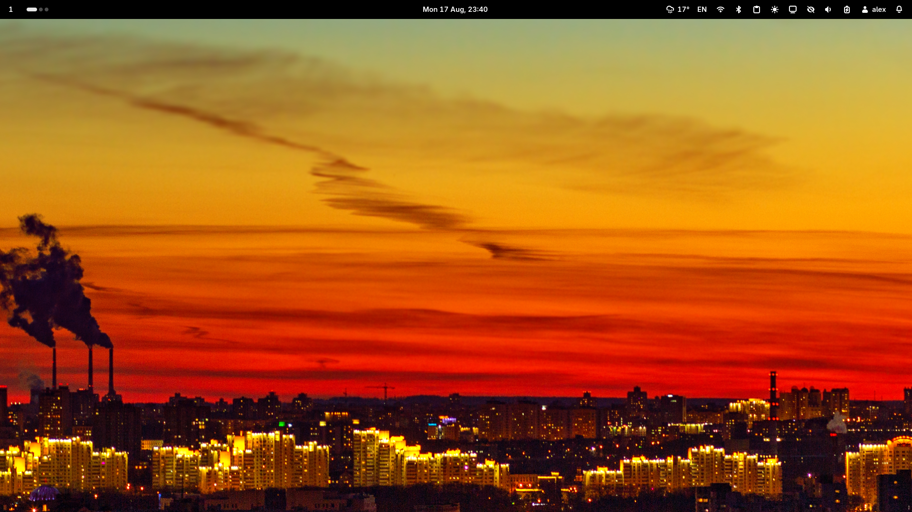
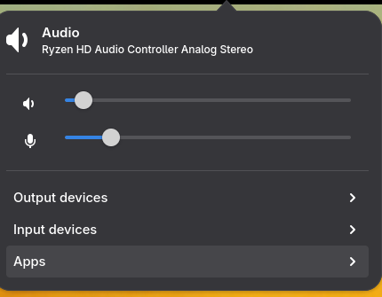
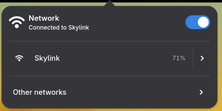
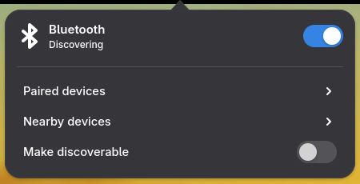
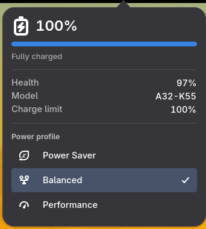
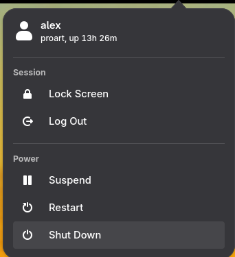
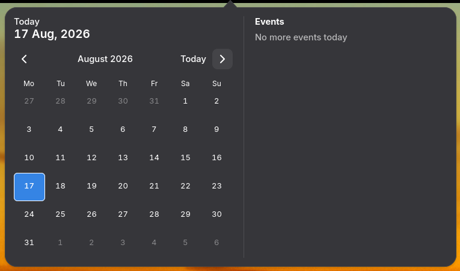
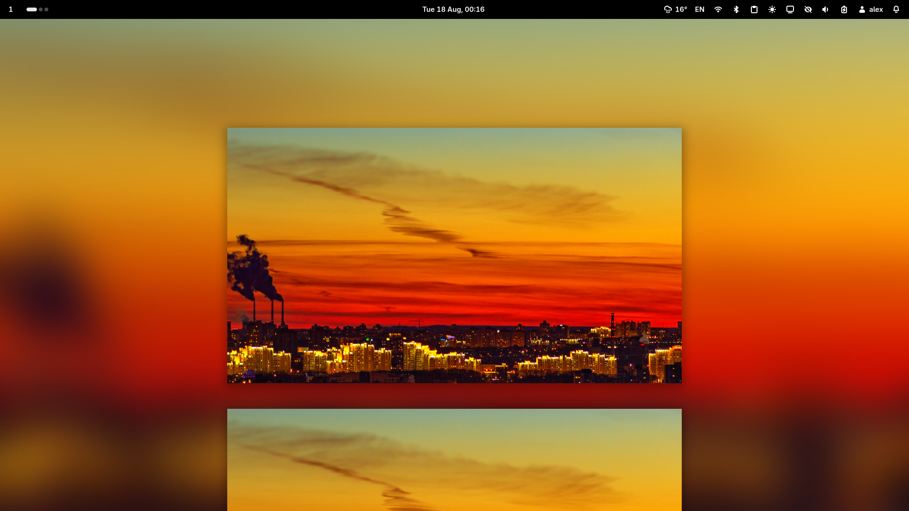

# Glimpse

Glimpse is a Wayland desktop shell toolkit for Niri. It provides the
desktop pieces that sit around the compositor: a panel, wallpaper and
backdrop surfaces, a lock screen, night light, and idle behavior.

The goal is a desktop that feels cohesive without becoming a full desktop
environment. Glimpse keeps configuration in readable files, ships polished
defaults, and lets you replace the parts that should reflect your setup.

## Contents

- [Screenshots](#screenshots)
- [Why Glimpse exists](#why-glimpse-exists)
- [What's inside](#whats-inside)
- [Installation](#installation)
- [Configuration](#configuration)
- [Calendar sources](#calendar-sources)
- [Wallpaper and backdrop](#wallpaper-and-backdrop)
- [Lock screen](#lock-screen)
- [Night light](#night-light)
- [Idle policy](#idle-policy)
- [Theming](#theming)

## Why Glimpse exists

Glimpse exists because a beautiful tiling desktop should not feel unfinished.

The project grew from a long KDE and GNOME desktop background. Niri brought
the workflow that felt right, but it still needed the surrounding desktop
layer: status, controls, wallpaper, locking, idle policy, and night color.
Glimpse is that layer for a Niri-first Wayland session.

Glimpse optimizes for:

| Value | What it means |
|---|---|
| **Niri-first workflow** | Built for a modern Wayland session around Niri. |
| **Professional feel** | Polished, restrained defaults for daily use. |
| **Small pieces** | Run the shell, wallpaper, lock, and idle pieces independently. |
| **Readable config** | Keep the desktop in TOML and CSS files that are practical to version. |
| **Daily comfort** | Make lock, idle, night light, wallpaper, and panel status work together. |

## Screenshots



Wallpaper by Christina Oleshkevich ([@krisn_ph](https://instagram.com/krisn_ph)).

<details>
<summary>Popovers</summary>









</details>

## What's inside

| Component | Purpose |
|---|---|
| `glimpse-shell` | GTK4 layer-shell panel with built-in and custom applets. |
| Calendar events | Configured online and local iCalendar feeds for the clock popover and next-event applet. |
| `glimpse-wallpaper` | Wallpaper and blurred backdrop daemon. |
| `glimpse-lock` | Session lock screen with PAM authentication and CSS theming. |
| Night light | Built into `glimpse-shell` with fixed or automatic schedules. |
| Idle policy | Built into `glimpse-shell` for lock, display power, suspend, commands, and inhibitor portal support. |

All runtime pieces read the same Glimpse configuration model. A normal setup
keeps the file at:

```text
~/.config/glimpse/config.toml
```

## Installation

Glimpse is packaged for Arch-based systems as a prebuilt AUR package:

```sh
yay -S glimpse-desktop-bin
```

Use your preferred AUR helper if you do not use `yay`.

The package installs:

```text
glimpse-shell
glimpse-wallpaper
glimpse-lock
```

It also installs systemd user services and the default PAM service file for
`glimpse-lock`.

### Enable services

For a normal Niri desktop, enable the shell and lock screen:

```sh
systemctl --user enable --now glimpse-shell.service
systemctl --user enable --now glimpse-lock.service
```

`glimpse-shell.service` owns the panel, idle policy, night light, idle inhibitor portal,
and wants `glimpse-wallpaper.service`, so starting the shell also starts the
wallpaper daemon. Enable `glimpse-wallpaper.service` directly only if you want
the wallpaper daemon without the shell.

Check service state:

```sh
systemctl --user status glimpse-shell.service
systemctl --user status glimpse-lock.service
```

View logs:

```sh
journalctl --user -u glimpse-shell.service -e
```

Replace `glimpse-shell.service` with the service you are checking.

### Version check

Each command supports `--version`:

```sh
glimpse-shell --version
glimpse-wallpaper --version
glimpse-lock --version
```

## Configuration

Glimpse starts with defaults when no config file is present. The default shell
has one top panel, built-in theme defaults, and the standard applet layout.

Config discovery order:

| Priority | Path |
|---|---|
| **1** | `GLIMPSE_CONFIG` environment variable |
| **2** | `./config.toml` in the current directory |
| **3** | `$XDG_CONFIG_HOME/glimpse/config.toml` |
| **4** | `$HOME/.config/glimpse/config.toml` when `XDG_CONFIG_HOME` is unset |

Create:

```text
~/.config/glimpse/config.toml
```

A compact starter config:

```toml
theme = "adwaita"
theme_mode = "auto"

[[panels]]
position = "top"
size = 36
left = ["pager", "mpris"]
center = ["clock"]
right = ["network", "battery", "session"]

[location]
provider = "static"
latitude = 52.2297
longitude = 21.0122
```

### Panel layout

Default panel layout:

- **Left:** `pager`, `mpris`
- **Center:** `clock`, `weather`, `notifications`, `privacy`
- **Right:** `next_event`, `tray`, `removable`, `clipboard`, `keyboard`, `printing`,
  `bluetooth`, `network`, `display`, `audio`, `idle`, `battery`, `session`

Panel options:

| Key | Purpose | Values |
|---|---|---|
| `position` | Screen edge for the panel. | `top`, `bottom`, `left`, `right` |
| `size` | Panel thickness in pixels. | Integer |
| `monitor` | Optional output name. | Example: `eDP-1` |
| `theme_mode` | Per-panel color mode. | `auto`, `light`, `dark` |
| `left`, `center`, `right` | Applet names for each section. | Array of names |

Use `"..."` inside a panel section to keep the default applets for that
section:

```toml
[[panels]]
position = "top"
left = ["...", "screenshot"]
center = ["clock"]
right = ["network", "battery", "..."]
```

### Built-in applets

| Applet | Purpose |
|---|---|
| `audio` | Volume, mute state, output device, and microphone indicator. |
| `battery` | Battery percentage, charging state, and power profile. |
| `bluetooth` | Bluetooth state and connected devices. |
| `brightness` | Screen brightness with monitor-aware scroll control. |
| `clipboard` | Clipboard history. |
| `clock` | Time, date, calendar, and optional world clocks. |
| `command` | A button or menu that runs commands. |
| `display` | Connected monitors status. |
| `exec` | A live custom status widget from your script or program. |
| `idle` | Idle inhibitor status. |
| `keyboard` | Current keyboard layout. |
| `mpris` | Media player status and controls. |
| `network` | Wi-Fi, wired network, and VPN status. |
| `next_event` | Next upcoming calendar event. |
| `notifications` | Notification center and popups. |
| `pager` | Workspaces and windows. |
| `printing` | Printer and print job status. |
| `privacy` | Camera, microphone, screen sharing, and location indicators. |
| `removable` | USB drives and removable storage. |
| `session` | Lock, logout, suspend, restart, and shutdown. |
| `tray` | Status notifier icons. |
| `weather` | Current weather and forecast. |
| `window` | Focused window title. |
| `workspace` | Current workspace name or index. |

Configure an applet with `[applets.<name>]`:

```toml
[applets.clock]
format = "%H:%M"
tooltip = "%A, %-d %B %Y"

[[applets.clock.timezones]]
name = "Tokyo"
timezone = "Asia/Tokyo"
```

Custom `exec` and `command` applets are loaded from applet package files in
`$XDG_CONFIG_HOME/glimpse/applets`. Put the package id in a panel section:

```toml
# ~/.config/glimpse/applets/terminal.toml
id = "terminal"
type = "command"

[command]
icon = "utilities-terminal-symbolic"
tooltip = "Open terminal"
command = ["ghostty"]
```

```toml
# ~/.config/glimpse/applets/screenshot.toml
id = "screenshot"
type = "command"

[command]
icon = "camera-photo-symbolic"
tooltip = "Copy area screenshot"
command = ["/bin/sh", "-c", "grim -g \"$(slurp)\" - | wl-copy"]
```

```toml
# ~/.config/glimpse/config.toml
[[panels]]
position = "top"
right = ["terminal", "screenshot", "network", "battery"]
```

`command` applets run a command on click and can expose a right-click menu.
`exec` applets run an external process that speaks the Glimpse applet protocol.

## Calendar sources

Calendar sources live in `[calendar]` and feed both the clock popover and the `next_event` applet. Use iCalendar subscription URLs from Google Calendar, Outlook, or another provider; Glimpse does not perform provider account login.

```toml
[calendar]
poll_interval = 600

[[calendar.sources]]
id = "personal"
type = "ical"
name = "Personal"
uri = "https://calendar.google.com/calendar/ical/example/basic.ics"
color = "#4285f4"

[[calendar.sources]]
id = "work"
type = "ical"
name = "Work"
uri = "file:///home/alex/.config/glimpse/calendars/work.url"
color = "#e01b24"

[[calendar.sources]]
id = "local"
type = "directory"
name = "Local"
uri = "file:///home/alex/.config/glimpse/calendars"
color = "#f6c343"
```

Supported source types are `ical` for one provider `.ics` URL or local `.ics` file, and `directory` for local directories of `.ics` files. A `file://.../work.url` iCal source can point to a local file that contains a provider URL, keeping that URL outside the main config. Every configured source is active; remove a source block to disable that calendar.

Source colors appear in calendar date markers, event rows, and the next-event panel label. Read [Calendar Sources](docs/calendar.md) for Google Calendar and Outlook ICS links, polling, dedupe, local test events, display rules, and debugging.

## Wallpaper and backdrop

`glimpse-wallpaper` uses `[wallpaper]` and `[backdrop]` from the shared config.

Solid color:

```toml
[wallpaper]
color = "#101010"
fit = "cover"
transition_ms = 800

[backdrop]
enabled = true
blur_radius = 24
```

Image wallpaper:

```toml
[wallpaper]
color = "#101010"
path = "/home/alex/Pictures/wallpapers/coast.jpg"
fit = "cover"
transition_ms = 800

[backdrop]
enabled = true
blur_radius = 24
```

Fit modes:

| Value | Behavior |
|---|---|
| `cover` | Fill the output while preserving aspect ratio. |
| `contain` | Fit the full image while preserving aspect ratio. |
| `fill` | Stretch the image to the output. |

When `[backdrop]` is enabled and `backdrop.path` is omitted, Glimpse derives
the backdrop from `wallpaper.path`.

Niri draws its own solid-color chrome behind the Overview (`Mod+O`) by
default, not the backdrop layer. To see the blurred backdrop there too, add
a layer-rule to your Niri config:

```kdl
layer-rule {
    match namespace="^glimpse-backdrop$"
    place-within-backdrop true
}
```

See [Wallpaper](docs/wallpaper.md#showing-the-backdrop-in-niris-overview)
for details.

## Lock screen

`glimpse-lock` listens for logind lock requests. Keep the service running and
trigger locks with:

```sh
loginctl lock-session
```

Add lock settings under `[lock]` in the shared config:

```toml
[lock]
pam_service = "glimpse-lock"
css_path = "themes/lock.css"

[lock.background]
path = "/home/alex/Pictures/wallpapers/night-city.jpg"
fit = "cover"
blur_radius = 24
dim = 0.35

[lock.clock]
enabled = true
time_format = "%H:%M"
date_format = "%A, %B %-d"

[lock.controls]
buttons = ["wifi", "input", "weather", "battery", "power"]
```

If you do not set a lock background, Glimpse uses the wallpaper config as the
fallback.

Preview lock styling without taking a real session lock:

```sh
glimpse-lock --preview
```

Export starter lock CSS:

```sh
glimpse-lock --export-css
```

## Night light

`glimpse-shell` applies a warmer display temperature on a schedule. It uses
`[night_light]` and, for automatic scheduling, `[location]`.

Automatic night-light setup:

```toml
[location]
provider = "static"
latitude = 52.2297
longitude = 21.0122

[night_light]
schedule = "automatic"
temperature = 4200
transition_minutes = 15
```

Fixed schedule setup:

```toml
[night_light]
schedule = "schedule"
start_time = "20:30"
end_time = "07:00"
temperature = 4200
transition_minutes = 15
```

Night-light schedule values:

| Value | Behavior |
|---|---|
| `off` | Disable night light. |
| `automatic` | Use location-based sunset and sunrise. |
| `schedule` | Use `start_time` and `end_time`. |

## Idle policy

`glimpse-shell` runs commands after the session has been idle for configured
timeouts. It supports separate AC and battery profiles and provides the idle
inhibitor portal used by apps that keep the session awake.

By default, Glimpse runs a three-step ladder: monitors off (10 min AC / 5 min
battery), lock session (15 min on both), suspend (60 min AC / 30 min battery).
Monitor power is dispatched through the bundled `/usr/share/glimpse/scripts/monitors` helper,
which supports both niri and hyprland.

Example laptop config (matches the defaults):

```toml
[idle]
enabled = true
respect_inhibitors = true

[idle.profiles.ac]
listeners = [
  { timeout = 600, on_idle = "/usr/share/glimpse/scripts/monitors off", on_resume = "/usr/share/glimpse/scripts/monitors on" },
  { timeout = 900, on_idle = "loginctl lock-session" },
  { timeout = 3600, on_idle = "systemctl suspend" },
]

[idle.profiles.battery]
listeners = [
  { timeout = 300, on_idle = "/usr/share/glimpse/scripts/monitors off", on_resume = "/usr/share/glimpse/scripts/monitors on" },
  { timeout = 900, on_idle = "loginctl lock-session" },
  { timeout = 1800, on_idle = "systemctl suspend" },
]
```

Listener options:

| Key | Purpose |
|---|---|
| `timeout` | Idle timeout in seconds. |
| `on_idle` | Shell command run when the timeout is reached. |
| `on_resume` | Shell command run when input resumes. |
| `respect_inhibitors` | Optional per-listener override for idle inhibitors. |

## Theming

Glimpse loads the built-in base CSS first, then loads your selected theme on
top of it.

User themes live in:

```text
~/.config/glimpse/themes/
```

Select a shell theme by file name without `.css`:

```toml
theme = "my-theme"
theme_mode = "auto"
```

This loads:

```text
~/.config/glimpse/themes/my-theme.css
```

Override the theme file directly with `GLIMPSE_THEME`:

```sh
GLIMPSE_THEME=/home/alex/.config/glimpse/themes/test.css glimpse-shell
```

Theme modes:

| Value | Behavior |
|---|---|
| `auto` | Follow the current interface color scheme. |
| `light` | Force light styling. |
| `dark` | Force dark styling. |

Starter shell CSS:

```css
:root {
  --accent-bg: #3584e4;
  --popover-padding: 14px;
}

.panel {
  background: rgba(20, 20, 20, 0.82);
  color: #f4f4f4;
}

.applet {
  padding: 0 8px;
}

.applet:hover {
  background: rgba(255, 255, 255, 0.08);
}
```

Lock screen CSS is configured separately:

```toml
[lock]
css_path = "themes/lock.css"
```

Relative lock CSS paths resolve from the Glimpse config directory. The default
path is:

```text
~/.config/glimpse/themes/lock.css
```
