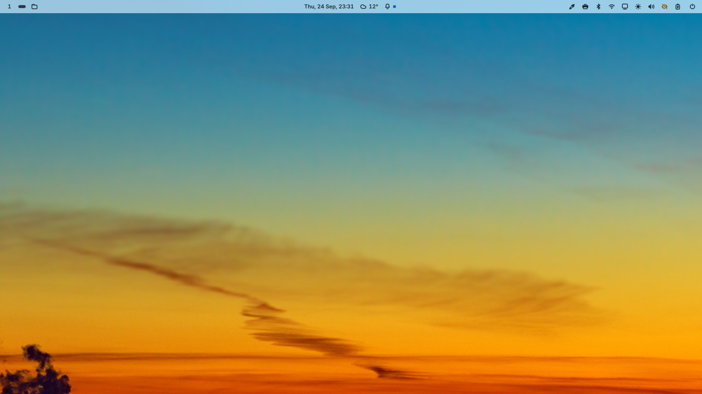
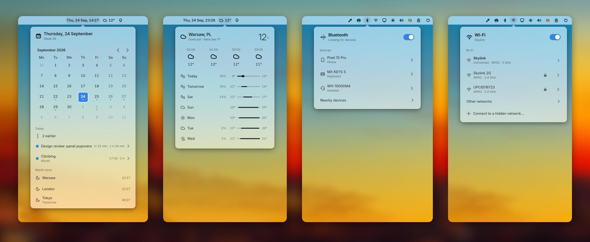

# glimpse

A desktop shell for Wayland: a panel, a wallpaper and a lock screen, built with GTK4 and
libadwaita.

<picture>
  <source media="(prefers-color-scheme: dark)" srcset="docs/screenshots/shell-dark.png">
  
</picture>

## About

glimpse adds what a bare Wayland compositor leaves out: a bar, notifications, a wallpaper, a lock
screen, idle timers and a night light. It follows your light or dark theme and accent color, and
blurs what sits behind it.

## Features

- Quick popovers for Wi-Fi, Bluetooth, audio, the calendar and the weather, and a few more.
- Notifications keep a history, and do not disturb holds them back.
- The lock screen authenticates through PAM.
- Idle timers blank the screens, lock and suspend, and can differ between AC and battery.
- The night light follows sunset and sunrise where you are.
- All settings live in one `config.toml`. Saving it applies the change, and a JSON schema gives your
  editor completion.

<picture>
  <source media="(prefers-color-scheme: dark)" srcset="docs/screenshots/applets-dark.png">
  
</picture>

## Installation

On Arch Linux, install the package from the AUR:

```sh
yay -S glimpse-desktop-bin
```

On Debian, Ubuntu or Fedora, the install script downloads the latest release as a `.deb` or `.rpm`,
checks it against the published checksums and installs it:

```sh
curl -fsSL https://raw.githubusercontent.com/alex-oleshkevich/glimpse/master/install.sh | bash
```

To build from source you need Rust 1.93 or newer, `just`, `blueprint-compiler` and gettext, plus the
development files for GTK4, libadwaita, gtk4-layer-shell, PulseAudio, PAM and udev. Then:

```sh
just install
```

### Start the shell

glimpse runs as a set of systemd user services. Enable them once from inside your Wayland session:

```sh
systemctl --user enable --now glimpse-session.target
```

The configuration lives in `~/.config/glimpse/config.toml`. Every setting and its default is listed,
with comments, in [`data/config.commented.toml`](data/config.commented.toml).

## Credits

glimpse is built on [GTK4](https://gtk.org), [libadwaita](https://gnome.pages.gitlab.gnome.org/libadwaita/),
[gtk4-layer-shell](https://github.com/wmww/gtk4-layer-shell), [relm4](https://relm4.org),
[zbus](https://github.com/dbus2/zbus) and [tokio](https://tokio.rs). Weather and geocoding come from
[Open-Meteo](https://open-meteo.com), location from [GeoClue](https://gitlab.freedesktop.org/geoclue/geoclue),
and icons from the [Adwaita](https://gitlab.gnome.org/GNOME/adwaita-icon-theme) icon theme.

glimpse is released under the [BSD 3-Clause license](LICENSE).
