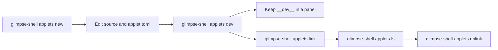

# Applet Tooling

`glimpse-shell` scaffolds, runs, links, lists, and debugs custom applets. Use it when you want a repeatable project directory instead of hand-editing every config file.

## Workflow Overview

| Phase | Command | Result |
|---|---|---|
| Create a project | `glimpse-shell applets new counter --lang python` | Creates an applet directory with source files and `applet.toml`. |
| Develop in place | `glimpse-shell applets dev counter` | Registers a temporary dev applet, watches source files, and restarts on changes. |
| Show dev applets | Keep `__dev__` in a panel section | Displays every active `.dev.toml` applet in that panel section. The default panel already includes it. |
| Link for local use | `glimpse-shell applets link counter` | Symlinks `counter/applet.toml` into the Glimpse applets directory so a panel can reference the applet by id. |
| Inspect or remove | `glimpse-shell applets ls`, `glimpse-shell applets unlink` | Shows linked and dev applets or removes linked applet entries. |



## Applet Project Directories

An applet project is a directory with an `applet.toml` file at its root. Exec applets also contain the source code or package files for one SDK language.

| File | Purpose |
|---|---|
| `applet.toml` | Applet definition used by `glimpse-shell applets link`, `glimpse-shell applets dev`, and distributed applet packages. |
| `src/main.rs` | Rust exec applet entry point, when scaffolded with `--lang rust`. |
| `main.py` | Python exec applet entry point, when scaffolded with `--lang python`. |
| `src/main.ts` | TypeScript exec applet source, when scaffolded with `--lang typescript`. |
| `main.go` | Go exec applet entry point, when scaffolded with `--lang go`. |

`applet.toml` uses package-style keys:

```toml
id = "counter"
type = "exec"

[exec]
command = ["uv", "run", "main.py"]
```

`glimpse-shell applets link` creates `~/.config/glimpse/applets/<id>.toml` as a symlink to that file. Glimpse discovers those files and lets panel config reference them by id.

## Create A Project

```sh
glimpse-shell applets new counter --lang python
cd counter
```

Supported exec languages are:

| Language flag | Generated files |
|---|---|
| `--lang rust` | `Cargo.toml`, `src/main.rs` |
| `--lang python` | `main.py` |
| `--lang typescript` | `package.json`, `tsconfig.json`, `src/main.ts` |
| `--lang go` | `main.go` |

Development mode runs the right build and launch steps for the selected
language. You edit the generated project; the applet tooling handles the rest.

Create a command applet instead of an exec applet when the applet only launches commands:

```sh
glimpse-shell applets new terminal --type command
```

Project names must use ASCII letters, numbers, `_`, or `-`, and cannot start with `.` or `-`.

## Develop With Live Reload

Run development mode from the project directory or pass the project path:

```sh
glimpse-shell applets dev
glimpse-shell applets dev /path/to/counter
```

Development mode:

| Behavior | Detail |
|---|---|
| Registers a dev applet | Writes `~/.config/glimpse/applets/<id>.dev.toml` while the command is running. |
| Watches source files | Rust watches `src` and `Cargo.toml`; Python watches `main.py`; TypeScript watches `src` and `tsconfig.json`; Go watches the project directory. |
| Rebuilds on change | Build failures are printed by the dev command, and the previous child is replaced after the next successful rebuild. |
| Replays startup data | The cached `init` line is sent to each restarted child. |
| Removes dev config on exit | The generated `.dev.toml` file is removed when the interactive dev process exits. |

The default panel already includes `__dev__`. If you use a custom panel layout, keep or add `__dev__` to show active dev applets:

```toml
[[panels]]
right = ["network", "__dev__", "battery"]
```

If a linked applet and a dev applet use the same id, the linked applet wins. Rename one of them or unlink the linked applet while testing.

## Link For Local Use

When the applet is ready for local use, link the project into the applets directory:

```sh
glimpse-shell applets link
glimpse-shell applets link /path/to/counter
```

The command resolves `applet.toml`, reads its `id`, and creates `~/.config/glimpse/applets/<id>.toml` as a symlink. Add the id to a panel section:

```toml
[[panels]]
right = ["counter", "network", "battery"]
```

Use `unlink` to remove the symlink created by `link`. It accepts a project path or a bare applet id:

```sh
glimpse-shell applets unlink
glimpse-shell applets unlink /path/to/counter
glimpse-shell applets unlink counter
```

## Distribute An Applet

`glimpse-shell applets link` is for local project use. It links a development
applet project into the applet search path so your panel can reference it by id.

To distribute an applet, ship the executable or script together with an
`applet.toml`. The user places that `applet.toml` in the applets directory:

```text
~/.config/glimpse/applets/
`-- my-applet.toml

/opt/my-applet/
`-- my-applet
```

The `applet.toml` describes the applet id, type, command path, environment, and
applet-specific runtime options. Point `command` at the shipped executable or
script:

```toml
id = "my-applet"
type = "exec"

[exec]
command = ["/opt/my-applet/my-applet"]
```

## Inspect And Diagnose

| Command | Use |
|---|---|
| `glimpse-shell applets ls` | Lists linked and dev applets with a `system\|user\|dev` qualifier. Accepts `--json`. |
| `glimpse-shell applets doctor` | Checks the host and language toolchains. |
| `glimpse-shell applets doctor --lang python` | Checks one language. |
| `glimpse-shell applets doctor --strict` | Exits non-zero if any check fails. Useful in scripts. |

## IPC Helpers

`glimpse-shell watch` and `glimpse-shell dispatch` connect to the Glimpse IPC socket. They use `GLIMPSE_IPC_SOCKET` when set, otherwise `$XDG_RUNTIME_DIR/glimpse/ipc.sock`, then `/tmp/glimpse/ipc.sock`.

| Command | Use |
|---|---|
| `glimpse-shell watch` | Subscribes to all shell events and prints them. |
| `glimpse-shell watch bluetooth.*` | Subscribes to matching event patterns. |
| `glimpse-shell dispatch open_uri uri=https://example.com` | Sends a shell command with key/value fields and waits for an acknowledgement. |

These helpers are useful when an applet calls shell actions through an SDK helper and you want to observe the shell side of the flow.

## See Also

| Page | Covers |
|---|---|
| [Getting Started](./getting-started.md) | Builds a counter applet from a generated project. |
| [Exec Applet](./exec.md) | Config and lifecycle for long-running applet processes. |
| [Line Protocol](./exec-protocol.md) | Raw stdin/stdout messages. |
| [Components](./exec-components.md) | Valid popover widget types and fields. |
| [Exec SDK](../applets/exec-sdk.md) | Language APIs for Python, TypeScript, Rust, and Go. |
