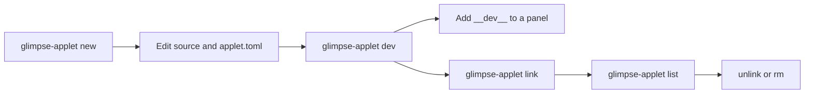

# Applet Tooling

`glimpse-applet` scaffolds, runs, links, lists, and debugs custom applets. Use it when you want a repeatable project directory instead of hand-editing every config file.

## Workflow Overview

| Phase | Command | Result |
|---|---|---|
| Create a project | `glimpse-applet new counter --lang python` | Creates an applet directory with source files and `applet.toml`. |
| Develop in place | `glimpse-applet dev counter` | Registers a temporary dev applet, watches source files, and restarts on changes. |
| Show dev applets | Add `__dev__` to a panel section | Displays every active `.dev.toml` applet in that panel section. |
| Install for normal use | `glimpse-applet link counter` | Symlinks `counter/applet.toml` into the Glimpse applets directory. |
| Inspect or remove | `glimpse-applet list`, `glimpse-applet unlink`, `glimpse-applet rm` | Shows installed applets or removes applet config entries. |



## Applet Project Directories

An applet project is a directory with an `applet.toml` file at its root. Exec applets also contain the source code or package files for one SDK language.

| File | Purpose |
|---|---|
| `applet.toml` | Package-style applet definition used by `glimpse-applet link` and `glimpse-applet dev`. |
| `src/main.rs` | Rust exec applet entry point, when scaffolded with `--lang rust`. |
| `main.py` | Python exec applet entry point, when scaffolded with `--lang python`. |
| `src/main.ts` | TypeScript exec applet source, when scaffolded with `--lang typescript`. |
| `main.go` | Go exec applet entry point, when scaffolded with `--lang go`. |

`applet.toml` uses package-style keys:

```toml
id = "counter"
type = "exec"

[exec]
command = ["uv", "run", "main.py"]
```

`glimpse-applet link` creates `~/.config/glimpse/applets/<id>.toml` as a symlink to that file. Glimpse discovers those files and merges them with applets declared directly in `~/.config/glimpse/config.toml`.

## Create A Project

```sh
glimpse-applet new counter --lang python
cd counter
```

Supported exec languages are:

| Language flag | Generated files | Dev command |
|---|---|---|
| `--lang rust` | `Cargo.toml`, `src/main.rs` | `cargo build --quiet`, then `cargo run --quiet` |
| `--lang python` | `main.py` | `uv run main.py` |
| `--lang typescript` | `package.json`, `tsconfig.json`, `src/main.ts` | `npx tsc`, then `node dist/main.js` |
| `--lang go` | `main.go` | `go build -o .dev-build`, then `.dev-build` |

Create a command applet instead of an exec applet when the applet only launches commands:

```sh
glimpse-applet new terminal --type command
```

Project names must use ASCII letters, numbers, `_`, or `-`, and cannot start with `.` or `-`.

## Develop With Live Reload

Run development mode from the project directory or pass the project path:

```sh
glimpse-applet dev
glimpse-applet dev /path/to/counter
```

Development mode:

| Behavior | Detail |
|---|---|
| Registers a dev applet | Writes `~/.config/glimpse/applets/<id>.dev.toml` while the command is running. |
| Watches source files | Rust watches `src` and `Cargo.toml`; Python watches `main.py`; TypeScript watches `src` and `tsconfig.json`; Go watches the project directory. |
| Rebuilds on change | Build failures are printed by the dev command, and the previous child is replaced after the next successful rebuild. |
| Replays startup data | The cached `init` line is sent to each restarted child. |
| Removes dev config on exit | The generated `.dev.toml` file is removed when the interactive dev process exits. |

Add `__dev__` to a panel section to show active dev applets:

```toml
[[panels]]
right = ["network", "__dev__", "battery"]
```

If an applet with the same id is declared directly in `config.toml`, that explicit config wins over a discovered dev applet. Rename one of them or remove the explicit entry while testing.

## Link For Normal Use

When the applet is ready, link the project into the applets directory:

```sh
glimpse-applet link
glimpse-applet link /path/to/counter
```

The command resolves `applet.toml`, reads its `id`, and creates `~/.config/glimpse/applets/<id>.toml` as a symlink. Add the id to a panel section:

```toml
[[panels]]
right = ["counter", "network", "battery"]
```

Use `unlink` to remove the symlink created by `link`:

```sh
glimpse-applet unlink
glimpse-applet unlink /path/to/counter
```

Use `rm` when you want to remove an installed applet by id:

```sh
glimpse-applet rm counter
glimpse-applet rm counter --yes
```

`rm` removes `~/.config/glimpse/applets/<id>.toml`. It asks for confirmation unless `--yes` is present.

## Inspect And Diagnose

| Command | Use |
|---|---|
| `glimpse-applet list` | Lists linked applets and active dev applets from `~/.config/glimpse/applets`. |
| `glimpse-applet doctor` | Checks the host and language toolchains. |
| `glimpse-applet doctor --lang python` | Checks one language. |
| `glimpse-applet doctor --strict` | Exits non-zero if any check fails. Useful in scripts. |

## IPC Helpers

`glimpse-applet watch` and `glimpse-applet dispatch` connect to the Glimpse IPC socket. They use `GLIMPSE_IPC_SOCKET` when set, otherwise `$XDG_RUNTIME_DIR/glimpse/ipc.sock`, then `/tmp/glimpse/ipc.sock`.

| Command | Use |
|---|---|
| `glimpse-applet watch` | Subscribes to all shell events and prints them. |
| `glimpse-applet watch bluetooth.*` | Subscribes to matching event patterns. |
| `glimpse-applet dispatch open_uri uri=https://example.com` | Sends a shell command with key/value fields and waits for an acknowledgement. |

These helpers are useful when an applet calls shell actions through an SDK helper and you want to observe the shell side of the flow.

## See Also

| Page | Covers |
|---|---|
| [Getting Started](./getting-started.md) | Builds a counter applet from a generated project. |
| [Exec Applet](./exec.md) | Config and lifecycle for long-running applet processes. |
| [Line Protocol](./exec-protocol.md) | Raw stdin/stdout messages. |
| [Components](./exec-components.md) | Valid popover widget types and fields. |
| [Exec SDK](../applets/exec-sdk.md) | Language APIs for Python, TypeScript, Rust, and Go. |
