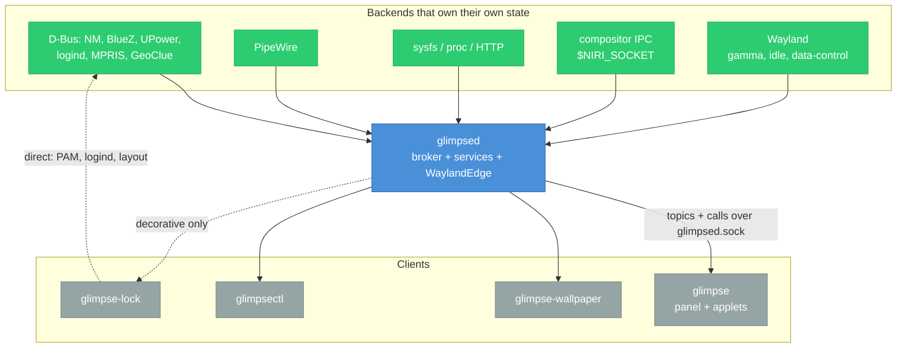

# 001 — Architecture

One daemon owns every piece of session state; the UI binaries are stateless clients on a single socket.

## Problem

A desktop suite is several processes that need the same information. A panel, a lock screen, a
wallpaper renderer and a CLI all want battery level, network state, audio volume and theme mode.
Without a shared owner, each opens its own PipeWire, UPower, NetworkManager and BlueZ connections,
each reimplements enumerate-then-follow-signals, and the four copies disagree during transitions.

Two pieces of state have no backing daemon at all. Tray items live in the applications that publish
them, and notifications exist only in flight. Whichever process owns
`org.kde.StatusNotifierWatcher` and `org.freedesktop.Notifications` _is_ the store. If that process
is the panel, restarting the panel drops both bus names, and every application that registered once
at startup loses its tray icon until it is restarted.

## Goals

- One owner for every piece of semantic state, so no two binaries can hold competing halves of one
  concern.
- A client that reconnects gets a correct, complete picture with no replay and no missed-event
  handling.
- Restarting any UI binary is free: nothing is lost, nothing needs re-registering.
- Services do no work when nobody is looking.
- The lock screen keeps working when the daemon does not.
- Services are testable without a display, a session bus, or a compositor.

## Non-goals

- No re-implementation of decisions a backing daemon already makes: no auto-connect policy, no
  reconnect loops, no band preference.
- No third-party in-process service plugins. Extensibility lives at the edges, in external applets.
- No XEmbed tray bridge. Applications that speak only the legacy X11 tray protocol get no icon.

## Tech

### Topology

### Invariants

When a feature conflicts with one of these, the invariant wins.

| #   | Invariant                                                                             | Consequence                                                                                                             |
| --- | ------------------------------------------------------------------------------------- | ----------------------------------------------------------------------------------------------------------------------- |
| 1   | **One writer per topic**                                                              | Two binaries can never hold competing halves of one concern.                                                            |
| 2   | **Topics are state cells, not event logs**                                            | Every event carries the full value. Reconnect equals resubscribe equals fresh snapshot. Coalescing is lossless.         |
| 3   | **UI processes hold no state that matters**                                           | Killing panel, wallpaper or lock is always safe.                                                                        |
| 4   | **glimpsed never writes configuration**                                               | The config file belongs to the user. Runtime adjustments are overrides in the state directory.                          |
| 5   | **glimpse-lock never depends on glimpsed for function**                               | It keeps direct PAM, logind and compositor-IPC paths. A dead daemon degrades it cosmetically.                           |
| 6   | **A session-scoped connection is held only when losing it is recoverable in-process** | Compositor IPC qualifies: a `UnixStream` reconnect rebuilds nothing. Wayland does not, so it sits behind `WaylandEdge`. |

### Binaries

Each binary has its own spec covering purpose, flags, arguments, subcommands, environment, files and
exit codes.

| Binary              | Spec                       | Wayland                | GTK   | Lifetime                                |
| ------------------- | -------------------------- | ---------------------- | ----- | --------------------------------------- |
| `glimpsed`          | `003_glimpsed.md`          | yes, via `WaylandEdge` | never | graphical session, `Restart=on-failure` |
| `glimpse`           | `004_glimpse_panel.md`     | layer-shell            | yes   | graphical session                       |
| `glimpse-wallpaper` | `005_glimpse_wallpaper.md` | layer-shell            | yes   | graphical session                       |
| `glimpse-lock`      | `006_glimpse_lock.md`      | `ext-session-lock-v1`  | yes   | on demand                               |
| `glimpsectl`        | `007_glimpsectl.md`        | never                  | never | one-shot / TUI                          |
| `glimpse-devtools`  | `008_glimpse_devtools.md`  | ordinary toplevel      | yes   | dev loop                                |

Wallpaper is its own process so that restarting the panel does not black the screen and so the
effects render loop does not share a process with panel code. Lock is its own process because it
must start when the panel is broken and must not share its crash domain.

### What glimpsed holds

**Broker.** Latest value per topic, subscriber registry with pattern matching, per-client
newest-value coalescing, fan-out, and the `stale` flag set when a service leaves `Running`. The
broker routes and nothing else: no icon work, no image decoding, no synchronous writes to clients.
Writes go to per-client channels; a client that exceeds its buffered-byte cap is disconnected.

**Client socket.** `$XDG_RUNTIME_DIR/glimpse/glimpsed.sock`, newline-delimited JSON frames.

**Service runtime.** Registry, lifecycle state machine, dependency DAG validated at registration,
health states, backoff with jitter, panic isolation per task.

**Two D-Bus names nothing else can own.** `org.freedesktop.Notifications` and
`org.kde.StatusNotifierWatcher`. A `StatusNotifierHost` is registered alongside the watcher;
applications that check `IsStatusNotifierHostRegistered` hide their icon when no host exists.

**The Wayland connection**, behind `trait WaylandEdge`: gamma
(`wlr-gamma-control-unstable-v1`, or `hyprland-ctm-control-v1` on Hyprland), `ext-idle-notify-v1`,
`ext-data-control-v1`.

### What glimpsed does not hold

GTK, any icon theme, rendering of any kind, panel layout, applet ordering and pinning, wallpaper,
PAM, external applet processes, or any database.

### Protocol

Newline-delimited JSON, one frame per line, `{id?, type, data}`.

| Frame                         | Direction | Purpose                                         |
| ----------------------------- | --------- | ----------------------------------------------- |
| `subscribe` / `subscribe_ack` | out / in  | register a pattern, receive matched count       |
| `unsubscribe`                 | out       | drop a pattern, releasing demand                |
| `get` / `get_result`          | out / in  | one-shot read of a topic's current value        |
| `call` / `call_result`        | out / in  | invoke a command, correlated by `id`            |
| `event`                       | in        | `{topic, seq, ts, stale, data}`, the full value |

Patterns are `audio.*` for one level and `tray.**` for a subtree. Errors carry
`{code, message, retryable}`. One `PROTOCOL_VERSION` is checked at handshake and bumped when a
payload changes incompatibly; per-topic versioning is not used.

### Services

**Owned** services hold state that exists nowhere else, so glimpsed is the source of truth.
**Mirror** services adapt a backend that owns its own state, so a restart means re-enumerate and
lose nothing.

| Service              | Kind     | Lifecycle             | Backend                                        |
| -------------------- | -------- | --------------------- | ---------------------------------------------- |
| notifications        | owned    | `OnBoot + Never`      | zbus object server                             |
| tray                 | owned    | `OnBoot + Never`      | watcher server, plus item and dbusmenu clients |
| nightlight           | computed | `OnBoot + Never`      | solar math or fixed times, via `WaylandEdge`   |
| theme                | computed | `OnBoot + Never`      | nightlight + config                            |
| idle                 | owned    | `OnBoot + Never`      | `WaylandEdge`                                  |
| clipboard            | owned    | `OnBoot + Never`      | `WaylandEdge`                                  |
| geolocation          | mirror   | `OnDemand + WhenIdle` | GeoClue2                                       |
| audio                | mirror   | `OnDemand + WhenIdle` | PipeWire                                       |
| battery              | mirror   | `OnBoot + WhenIdle`   | UPower                                         |
| network              | mirror   | `OnDemand + WhenIdle` | NetworkManager                                 |
| bluetooth            | mirror   | `OnDemand + WhenIdle` | BlueZ                                          |
| mpris                | mirror   | `OnDemand + WhenIdle` | MPRIS                                          |
| brightness           | mirror   | `OnDemand + WhenIdle` | logind / sysfs                                 |
| workspaces, keyboard | mirror   | `OnBoot + WhenIdle`   | compositor IPC socket                          |
| power                | mirror   | `OnBoot + Never`      | logind suspend and resume signals              |
| weather              | poll     | `OnDemand + WhenIdle` | HTTP                                           |
| calendar             | poll     | `OnDemand + WhenIdle` | iCal over HTTP, or a directory                 |
| sysstats             | poll     | `OnDemand + WhenIdle` | /proc, sysfs                                   |
| watcher              | owned    | `OnBoot + Never`      | inotify over the config and stylesheet paths   |

Demand that starts an `OnDemand` service: a client pattern matches one of its topics, an in-process
`Ctx::subscribe` targets one, a `call` names one of its commands, or a dependent service starts.
`WhenIdle` begins a grace timer when the last of those disappears; new demand cancels it.

Mirror services follow one shape: enumerate once at start, then follow change signals. Three rules
keep them honest.

- The backend is right when they disagree. Converge, do not arbitrate.
- Never reimplement a decision the backend already makes.
- Commands are thin pass-throughs. `network.connect { uuid }` calls `ActivateConnection` and lets
  the backend's state machine produce the result.

### The computed chain

| Topic                  | Producer    | Consumers                      |
| ---------------------- | ----------- | ------------------------------ |
| `geolocation.position` | geolocation | nightlight, weather            |
| `nightlight.schedule`  | nightlight  | theme, panel                   |
| `nightlight.state`     | nightlight  | panel                          |
| `theme.mode`           | theme       | panel CSS, wallpaper, lock CSS |

`ctx.subscribe` counts as demand, so `theme` subscribing to `nightlight.state` keeps nightlight
alive regardless of external subscribers. The DAG orders boot and cascades `degraded` downward, so
`theme.mode` consumers can render the daemon's honesty about stale upstream data.

### Tray

The service that most defines the architecture, because nothing else holds its state.

| Concern                                                                                   | Owner    |
| ----------------------------------------------------------------------------------------- | -------- |
| watcher bus name, item roster, registration and death                                     | glimpsed |
| metadata: id, title, status, category, tooltip, `ItemIsMenu`, `IconName`, `IconThemePath` | glimpsed |
| action proxying: `Activate`, `SecondaryActivate`, `ContextMenu`, `Scroll`                 | glimpsed |
| dbusmenu layout, revisions, `AboutToShow`, `Event`                                        | glimpsed |
| resolving `IconName` through the GTK icon theme                                           | panel    |
| menu rendering, ordering, pinning, hiding, click policy from `is_menu`                    | panel    |

Pixmaps do not travel through the socket. glimpsed decodes `IconPixmap` and writes
`$XDG_RUNTIME_DIR/glimpse/tray/<item>-<hash>.png`, then publishes the path. The content hash is
what makes the equality gate work; a fixed path per item would never change value and the panel
would never reload.

Item identity comes from the SNI `Id` property. Bus names change on application restart, and pinned
order keyed on them shuffles every reboot.

Menu layout lives in an `on_demand`-gated dynamic topic, `tray.item.{id}.menu`. The panel fires
`tray.menu_about_to_show` and subscribes on pointer-enter rather than on click, which hides the
`GetLayout` round trip inside the time between hover and click. Layout arrives as a topic rather
than a command result because menus mutate while open.

`Activate` on a wedged application can block for the full D-Bus timeout, so its `Responder` moves
into `ctx.spawn`. A serial handler would freeze every other item.

### Wayland

`trait WaylandEdge` has a real implementation and a mock. Services depend on the trait, so service
tests run headless and only the Wayland module needs a compositor.

| Capability | Protocol                                                                  | Absent                                                                        |
| ---------- | ------------------------------------------------------------------------- | ----------------------------------------------------------------------------- |
| gamma      | `wlr-gamma-control-unstable-v1`, or `hyprland-ctm-control-v1` on Hyprland | nightlight computes and publishes its schedule, actuation missing, `degraded` |
| idle       | `ext-idle-notify-v1`                                                      | idle service `degraded`                                                       |
| clipboard  | `ext-data-control-v1`                                                     | clipboard service `degraded`                                                  |

Gamma has three details that matter: apply per output and skip those reporting `gamma_size == 0`;
re-apply the current target on hotplug before an untinted monitor is visible; and detect a competing
gamma client (wlsunset, gammastep, hyprsunset) rather than flickering against it.

### Lifecycle

All four long-lived binaries are systemd user units bound to `graphical-session.target` with
`PartOf=` + `After=` + `Requisite=`. `glimpsed` is `Type=notify` and signals readiness once the
socket is listening and every `OnBoot` service has reached `ready` or `degraded`; the panel and
wallpaper are ordered after it with `Wants=`, not `Requires=`, so a dead daemon does not take them
down. `glimpse-lock` has no `[Install]` section and is started on demand.

Units, sandboxing rules, D-Bus activation and the environment-propagation problem are in
`009_systemd.md`.

## Alternatives considered

- **One process per service, no central daemon** — rejected: every cross-service dependency becomes
  a socket hop, clients go from one connection to N plus a discovery problem, and config layering,
  coalescing and pattern matching get reimplemented per binary. `stale` also requires a value store
  that outlives the service.
- **A separate Wayland edge agent** — rejected: the property worth having is services testable
  without a display, and a trait boundary provides it. A process boundary additionally costs a
  crate, a unit, an attach protocol and replay semantics.
- **Backend listeners inside the panel, as Plasma's applets do** — rejected: Plasma has one UI
  process and glimpse has five. The lock screen would need its own NetworkManager connection and its
  own SSID grouping, or a panel-to-lock side channel, which is a worse daemon.
- **gRPC** — rejected: pattern subscriptions and runtime-created topics do not fit a compile-time
  service surface, and the `Any`-payload workaround keeps the dependency while discarding the
  typing. SDK codegen is obtained instead by deriving JSON Schema from `glimpse-proto`.
- **D-Bus for the client API** — rejected: no snapshot-on-subscribe, no per-client coalescing, and
  `dbus-daemon` disconnects clients that exceed its queue rather than degrading them. A thin
  read-only facade on `me.aresa.Glimpse` remains possible for scripting.
- **Binary payload encodings (protobuf, bincode, postcard)** — rejected: costs `socat` and `jq`
  debugging and turns the four-language SDK into a codegen project, to save microseconds that do not
  register against a frame budget. If size ever matters, the codec is negotiated at handshake.
- **Persistence for clipboard and notification history** — rejected: not wanted, and dropping it
  removes the state directory, schema versioning, migrations and downgrade protection.
- **Wallpaper folded into the panel** — rejected: every panel restart would black the screen, and
  live effects would put a GL loop in the panel process.
- **greetd as the lock backend** — rejected: greetd is a login manager. Its socket exists only in
  the greeter process and it exposes no way to verify a password inside a running session. A greeter
  built on greetd is a separate program that shares `glimpse-widgets`.
- **Service-side subscriber filtering** — rejected: it puts per-subscriber code in every service and
  couples subscriber count to service hot paths. Services need to know only _whether_ anyone is
  watching, which is `on_demand`.

## Risks

- **Technical** — dbusmenu is a stateful, chatty protocol with revisions, lazy submenus and
  invalidation signals; it is the largest single piece of the tray service and the easiest to get
  subtly wrong.
- **Technical** — gamma control is exclusive. A user running wlsunset or hyprsunset alongside
  glimpse gets flicker unless the conflict is detected and reported.
- **Operational** — glimpsed owns two well-known bus names. A crash loop takes tray and notifications
  down for every application in the session, so backoff and health reporting are not optional.

## Open questions

- **Clipboard scope.** Without history, the remaining job is selection persistence: keeping the
  clipboard alive after the source window closes. It needs continuous capture and no database, and
  it is the sole justification for `OnBoot + Never` on that service.
- **Agents.** Registering as NetworkManager secret agent and BlueZ pairing agent forces
  `OnBoot + Never` on those services and introduces the only inbound flow that holds a D-Bus reply
  open across a UI round trip, with a multi-minute timeout and a dependency on a running panel.
- **External applet write access.** Whether applet processes may publish topics or only read them
  changes the broker's write path and the trust model.

## Implementation TODO

- [ ] `glimpse-proto`, broker, one trivial service, `glimpsectl watch` — prove the topic model in a
      terminal with no GTK and no Wayland
- [ ] audio service — high event rate, inline commands, `on_demand` gating; the point at which to
      change the service trait if it is wrong
- [ ] minimal panel with two applets, end to end
- [ ] notifications and tray
- [ ] `WaylandEdge`, then the nightlight to theme chain
- [ ] wallpaper, lock

## Reference implementations

Read from source while designing; useful when a detail is disputed.

| Fact                                                                             | Source                                                                                                                                               |
| -------------------------------------------------------------------------------- | ---------------------------------------------------------------------------------------------------------------------------------------------------- |
| KDE's StatusNotifierWatcher is a kded module, not part of plasmashell            | `plasma-workspace/statusnotifierwatcher/`: `class StatusNotifierWatcher : public KDEDModule`, `"X-KDE-Kded-autoload": true`, installed to `kf6/kded` |
| KDE's system tray applet is only a Host client of that watcher                   | `plasma-workspace/applets/systemtray/statusnotifieritemhost.cpp:86-88`, `RegisterStatusNotifierHost`                                                 |
| SNI clients re-register when the watcher's bus owner changes                     | `kstatusnotifieritem/src/kstatusnotifieritem.cpp:849-851` (`WatchForOwnerChange`), re-registration at :976                                           |
| NetworkManager exposes access points, not networks; SSID grouping is client-side | `networkmanager-qt/src/wirelessdevice.cpp` `accessPointAdded()`; `wirelessnetwork.cpp` `updateStrength()`                                            |
| plasma-nm enumerates once then follows signals                                   | `plasma-nm/libs/models/networkmodel.cpp` `initialize()` then `initializeSignals()`                                                                   |
| Scanning runs only while the popup is open                                       | `plasma-nm/applet/main.qml:155`, `Timer { interval: 10200; running: mainWindow.expanded && ... }`                                                    |
| NetworkManager rate-limits `RequestScan`; plasma-nm defers rather than erroring  | `plasma-nm/libs/handler.cpp:53` `NM_REQUESTSCAN_LIMIT_RATE 10000`, `scheduleRequestScan()`                                                           |
| plasma-nm's secret agent lives in the daemon, not the applet                     | `plasma-nm/kded/secretagent.cpp`                                                                                                                     |
| KDE's night light is a compositor plugin                                         | `kwin/src/plugins/nightlight/nightlightmanager.cpp`                                                                                                  |

## Changelog

- 2026-08-20 — created.
- 2026-08-20 — dropped the night-light settings window; configuration is hot-reloaded TOML and the
  only interaction needing speed is a panel popover toggle.
- 2026-08-20 — moved per-binary detail into specs 003-008 and systemd units into 009; this spec keeps
  the shape and the cross-cutting rules.
- 2026-08-20 — invariant 4 reworded for the single `config.toml`; schema and layering live in `010_configuration.md`.
- 2026-08-20 — added the `watcher` service, which moves configuration and stylesheet watching out of the UI processes; see `011_watcher.md`.
- 2026-08-20 — added the `calendar` service; `_old` already configures calendar sources and nothing in the new design owned them.
